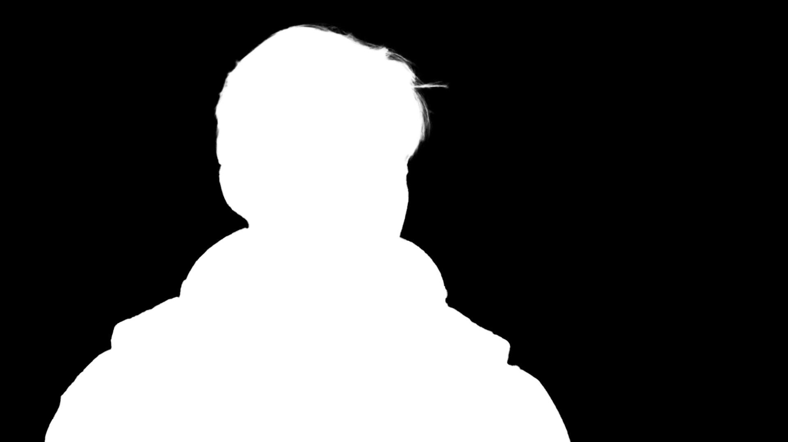

# Matting-comparison-on-Interstellar

<p align="center">
    
    
</p>

This project makes a comparison between In-Context Matting and Robust Video Matting on a 5s-clip from the movie *Interstellar*. The comparison is based on the quality of the alpha matte.

The repository above includes part of the code of In-Context Matting needed for testing on the Interstellar clip. The original repository of In-Context Matting can be found [here](https://github.com/tiny-smart/in-context-matting).

Because the [Colab demo](https://colab.research.google.com/drive/10z-pNKRnVNsp0Lq9tH1J_XPZ7CBC_uHm?usp=sharing) is provided in the original repository of Robust Video Matting, which can generate the result automatically, the code of Robust Video Matting is not included in this repository. The original repository of Robust Video Matting can be found [here](https://github.com/PeterL1n/RobustVideoMatting).

## Introduction of Interstellar Dataset

The Interstellar dataset is a 5s-clip from the movie *Interstellar* (2:43:34-2:43:39). The dataset includes 120 frames, and the corresponding alpha mattes and trimaps of the frames. The dataset is used to evaluate the performance of In-Context Matting and Robust Video Matting.

## Installation of In-Context Matting

It is recommanded to run the code in a conda environment in a Linux system, or some unpredictable version-related issues may occur.
**Python 3.10, CUDA 11.7, Pytorch 1.13.1** are used in this project, but other versions may also work, as long as the required packages in right versions are installed. For more details, please refer to [the original repository of In-Context Matting](https://github.com/tiny-smart/in-context-matting).
After configuring your conda base environment, you can create an environment named 'icm' and install the required packages by simply running the following command:

    conda env create -f environment.yml

## Prepare Your Data

1. Download the Interstellar clip, the frames generated from the clip, and the alphas & trimaps of the frames from [Baidu Netdisk](https://pan.baidu.com/s/1l4rt-ujT6wiFoxSYCqm8qQ?pwd=ct74) with the extraction code `ct74`.
2. The final path structure used in the code looks like this:

````
datasets/Interstellar
├── image
└── alpha
└── trimap
````

## Usage of In-Context Matting on the Interstellar Clip

To evaluate the performance on the Interstellar using the `eval.py` script, follow these instructions:

1. **Download the Pretrained Model:**
Download the pretrained model from [this link](https://pan.baidu.com/s/1HPbRRE5ZtPRpOSocm9qOmA?pwd=BA1c).

2. **Prepare the dataset:**
Ensure that your Interstellar is ready.

3. **Run the Evaluation:**
Use the following command to run the evaluation script. Replace the placeholders with the actual paths if they differ.

       python eval.py --checkpoint PATH_TO_MODEL --save_path results/ --config config/eval.yaml

## Usage of Robust Video Matting on the Interstellar Clip

You can simply click [this link](https://colab.research.google.com/drive/10z-pNKRnVNsp0Lq9tH1J_XPZ7CBC_uHm?usp=sharing) to open the Colab demo of Robust Video Matting, and then follow the instructions in the demo to generate the result.

## Comparison

`cal_metric_icm.py` is used to calculate the metrics of the alpha matte generated by In-Context Matting, and `cal_metric.py` is used to calculate the metrics of the alpha matte generated by Robust Video Matting. The metrics include MAD, MSE, Grad, Conn and dtSSD (the same metrics used in [Robust Video Matting paper](https://arxiv.org/pdf/2108.11515.pdf)).

These script requires the alpha mattes generated by In-Context Matting and Robust Video Matting. Originally, In-Context Matting generates frames as requested (which can be downloaded [here](https://pan.baidu.com/s/1ygIQwJcXUn_YxkKvQ0Tv8w?pwd=8u92) generated by myself), **but the result of Robust Video Matting is a video clip. Therefore, you need to extract the frames from the video clip generated by Robust Video Matting using tools like FFmpeg or other video editing software.** (or you can download the frames extracted by myself [here](https://pan.baidu.com/s/1iaxs-RL6jQGD2iMP7L_fyQ?pwd=mmoz)).

You need to **change the directories** in `cal_metric_icm.py` and `cal_metric.py` to fit your own directory, Then you can run the following command to calculate the metrics:

    python cal_metric_icm.py 
    python cal_metric.py

The metrics will be printed in the console.

## Results of my own experiment

The metrics of the alpha mattes generated by In-Context Matting and Robust Video Matting are as follows:

| Methods | MAD | MSE | Grad | Conn | dtSSD |
| :--: | :--: | :--: | :--: | :--: | :--: |
| In-Context Matting | 7.75 | 3.08 | 1.89 | 6.42 | 5.60 |
| Robust Video Matting | 3.56 | 1.33 | 4.59 | 3.37 | 3.97 |

## Statement

The code in this repository is only used for academic research and personal practice. If you find this work or code useful for your research, please cite the original repositories of In-Context Matting and Robust Video Matting. Thank you for your attention.
If you have any questions, please feel free to contact me at [ls13572468@foxmail.com](mailto:ls13572468@foxmail.com).
